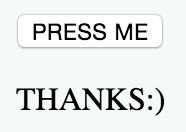

# HTML DOM: Changing Content

1. Add a new button tag to your HTML document. The button tag should be inside <body>. The text shown on the button should be "CLICK ME". When the user clicks the button the function clickMe() should be called.

2. Add a 
 element below the button. The id of the element should be "feedback".

3. In your JavaScript code, write a function called clickMe(). When the function is called it should set the text "THANKS:)" to the 
 element.