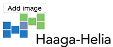

# HTML DOM: Changing Structure

1. Add a new button tag to your HTML document.  The id of the button should be "add".

2. The text shown on the button should be "Add image". When the user clicks the button the function addImg() should be called.

3. Add a 
 element below the button. The id of the element should be "images".

4. In your JavaScript code, write a function called addImg(). When the function is called it should add a new Haaga-Helia logo in the images 
.

