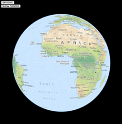

# WebGL Earth API

In this exercise, I am extending my own application by using the API (Application Programming Interface) of an open source service. This time, I use The WebGL Earth service. It provides a mechanism for inserting interactive maps into web pages.

1. In the HTML document, add two new buttons inside the buttons < div> . The texts shown on the buttons should be "GO HOME" and "SHOW COORDS". When the user clicks the button "GO HOME" the function goHome() should be called. When the user clicks the button "SHOW COORDS" the function showCoords() should be called.

2. In your JavaScript code, write a function called showCoords(). When the function is called it should show the current coordinates of the map center in an alert dialog box.

3. In your JavaScript code, write a function called goHome(). When the function is called it should set the map center to the latitude / longitude position of your own home and zoom the map close enough. 

