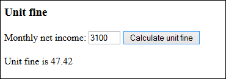

# Unit Fine

A car driver (a motorist) was driving too fast. He drove 20 km/h over the speedlimit, so the police needed to fine him. Finnish unit fines (päiväsakot) are based on the net income of the driver. One fine unit (päiväsakko) can be calculated as: (net income - 255)/60. Create a program that tells how much is one fine unit for inputed net income.

```
-Define a function that calculates the fine unit (euros) based on given net income (euros).
-Function call toFixed(2) returns the value of a number rounded to two decimals
```

One sample output for shown input:



