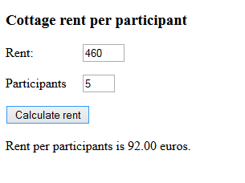

# Summer Cottage

A group of people goes to a summer cottage for one weekend. The program asks for the total rent and number of participants and then calculates the cost per person.\

One sample output for shown input:

