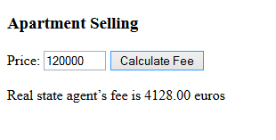
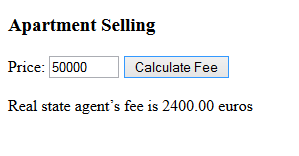

# Agent's Fee

Make a program that asks the selling price of the apartment and calculates the fee of the real estate agent. The fee is 3.44% selling price but always at least 2 400 euros.

Sample output for shown input:

For example, if the price is 120 000 euros then the fee is 4 128 euros (as that is above the 2 400 minimum fee). If the selling price would be 50 000, then the fee would be 2 400 euros.