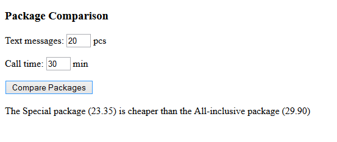

# Package Comparison

Make a program for comparing two mobile phone subscription packages. The program asks for the amount of call time and the number of sent text messages, and tells which package would be cheaper.

Sample output for shown input:

The first package is an all-inclusive package where unlimited data, calls and text messages are covered by the monthly fee 29.90 euros. The second special package has unlimited data included in the monthly 19.90 euro fee but the calls are 0.069 euros per minute and text messages 0.069 euros a piece.

|                     | Monthly Fee | Calls (min) | Text messages(pcs) |
| :-----------------: | :---------: | :---------: | :----------------: |
|All-inclusive package| 29.30       | unlimited   | 0.069              |
|Special package      | 19.90       | 0.069       | 0.069              |

1. Calculate how much the Special package would cost for given amount of calling time and number of text messages.
2. Compare the total prices with the if statement to find out which package would be the cheapest.