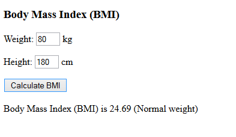

# Body Mass Index

Make a program that asks for the user’s weight and height and calculates, and tells the body mass index class. The body mass index is BMI = weight / (height/100.0 * height/100.0).

Sample output for shown input:

| Weight less than normal weight| 18.4 or less |
| ----------------------------- | ------------ |
| Normal weight                 | 18.5 - 24.9  |
| Overweight                    | 25.0 or more |
