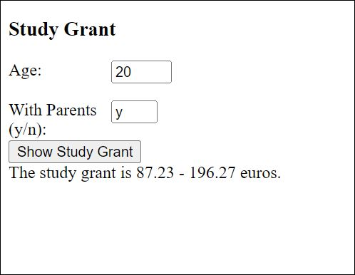

# Study Grant

Finnish students receive study grant (opintoraha) from government organization Kela.

Make a program that shows the size of the study grant.

Sample output for shown input:

.JPG)

The study grant (opintoraha) is defined based on the following (simplified) rules:

| 20 years or older students who lives independently| 268.23 euros         |
| ------------------------------------------------- | -------------------- |
|20 years or older students living with parents     | 87.23 - 196.27 euros |
| Otherwise                                         | "Ask Kela"           |

Sample output for shown input:

