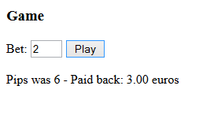

# Game *

In a coin slot machine (One-handed robber) a game returns pay (won money) according to the following rules:
```
-The game will randomize dice pips between 1-6. You can randomize the pips with var pips = Math.round( (Math.random( ) * 5) + 1 );
-No pay if the randomized pips is 1, 3 or 5
-The pips 2 and 4 return the set coins back 125% (=multiplied by 1.25)
-The pips 6 returns the inserted bet 150%
```

Sample output for shown input:


