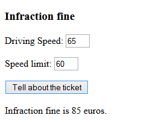
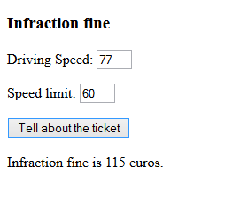
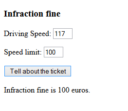
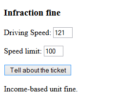

# Infraction Fine

If a car driver speeds no more than 20 km/h over the speed limit, the driver will avoid the income-based unit fines (päiväsakot), and gets just the infraction fine (rikesakko). Make a program that tells how much the infraction fine is. It’s based on the speed limit and the excess speed. The program asks for the driving speed and the speed limit. If there is speeding the ticket will be decided upon based on the following rules:

```
-If the speed limit is 10-60 kilometers an hour, and the excess speed is no more than 15 km/h, the speeding leads into a 85-euro infraction fine (rikesakko). More than 15 but no more than 20 km/h leads into an infraction fine of 115 euros.
-If the speed limit is 70-120 kilometers an hour, a max 15 km/h speeding will be penalizes with 70-euro infraction fine. The infraction fine is 100 euros when the excess speed is more than 15 km/h, but no more than 20 km/h.
-(If the driver drives more than 20 km/h over the limit => he will get unit fines, päiväsakko.
If the driver doesn't drive over the limit =>he will get message "No speeding, no fine".)
```

Sample output for shown input:







