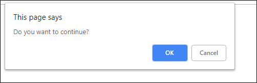
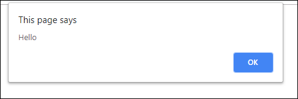

# While loop

A dialog box is a small temporary window an application creates to display information or request user input. Modal dialog boxes temporarily halt the program until the user closes the dialog. Modal dialog boxes are created, perform their task, and are destroyed by calling a single function

Make a program that displays a confirm dialog box with the text "Do you want to continue?" again and again until the user clicks the Cancel button in the dialog box. If the user clicks the OK button in the dialog box, then the program shows an alert dialog box with the text "Hello!". After the user has closed the alert dialog box the program shows the confirm dialog box again.

#### Confirmation box

#### Alert box
