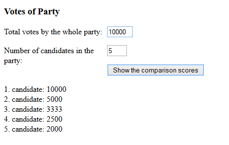

# Votes for party

In Finland the D'Hondt method is used to calculate the comparison score for each election candidate. First the total number of votes for one party is summed up. After that the election candidates in that party are ordered based on their individual vote count. The most popular candidate is given a comparison score equal to her/his party’s total vote count. The second most popular gets 1/2, third 1/3 and so on. The formula is V/o, where V is total vote count by the party and o is the ordinal (järjestysluku) of that candidate. Make a program that shows the comparison scores for a party.

(The toFixed(0) method call helps you get rid of decimals (0 decimals))

Sample output for shown input:

