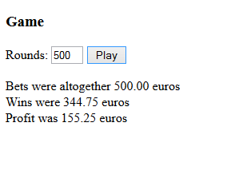

# Coin slot machine
In a coin slot machine (One-handed robber) a game returns pay (money won) according to the following rules:

```
-The game will randomize dice pips between 1-6

| let pips = Math.round( (Math.random( ) * 5) + 1 ); |
| -------------------------------------------------- |

-No pay if the randomized pips is 1, 3 or 5
-The pips 2 and 4 return the set coins back 125% (=multiplied by 1.25)
-The pips 6 returns the inserted bet 150%
```

This algorithm was already done when we learned selection structures. Let’s reuse it now.
Make a program with which the game firm can estimate the profits by test running the game multiple times. The program asks how many rounds of the game will be run. (Assume that the bet was 1 euro each time)

Sample output for shown input:



.png)