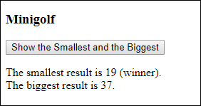

# Minigolf
The cottage guests were playing minigolf. Make a program that tells the smallest (winner) and biggest (last one) results.The results for the eight players are in the array below:
```js
let minigolf = [23, 19, 37, 20, 21, 30, 26, 24];  // let declaration for Viope. Viope tests many arrays
```
#### Minigolf button
