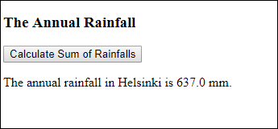

# Rainfall
Make a program that calculates the annual rainfall in Helsinki and displays it on the HTML page. This is how you can create an array object of twelve monthly rainfall values:

```
let rainfall = [47.0, 36.6, 34.7, 37.0, 41.9, 47.5, 61.7, 74.8, 65.4, 69.7, 66.1, 54.6]; // let declaration for Viope. Viope tests many arrays
```

Sample output:

