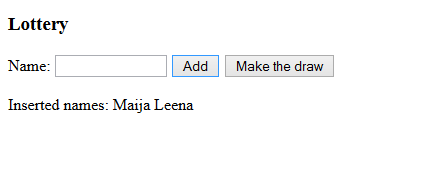
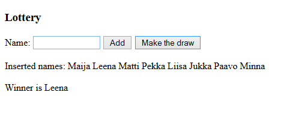

# Lottery
After the successful cottage retreat people decided to make a draw (raffle/lottery, arpajaiset) for deciding who gets the remaining food. Make a program that asks for the name of all the attendants and randomize the winner.

Sample output after two names have been added:

Sample output after several names have been added AND the draw has been made:

