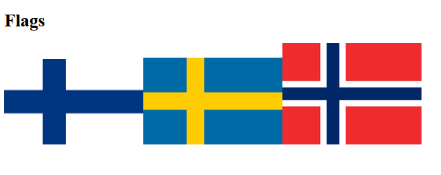

# Function Call with parameters

There are also such functions that accept one or more input parameters. You can affect to the result of the function execution by passing different input data to the function. 

The existing function addImage (imageUrl) adds an image to a HTML page. Call the function three times and pass each time a different image URL to the function.

In the first function call, pass the following string to the function:

"https://upload.wikimedia.org/wikipedia/commons/thumb/b/bc/Flag_of_Finland.svg/250px-Flag_of_Finland.svg.png"

In the second function call, pass the following string to the function:

"https://upload.wikimedia.org/wikipedia/en/thumb/4/4c/Flag_of_Sweden.svg/250px-Flag_of_Sweden.svg.png"

In the third function call, pass the following string to the function:

"https://upload.wikimedia.org/wikipedia/commons/thumb/d/d9/Flag_of_Norway.svg/250px-Flag_of_Norway.svg.png".