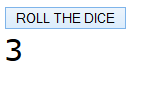

# Parameters and Return Value

The same function can accept input parameters and return a value.

The function rollTheDice() should do the following:

1. Call the function getRandomInteger(min, max) with parameter values 1 and 6, and assign the return value of the function to the variable diceValue (noppa).

2. Insert the value of the variable diceValue into the HTML div element whose id is 'dice'.