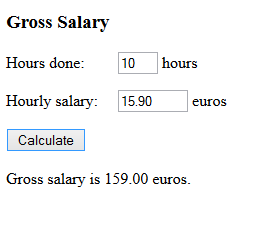

# Gross salary

Make a program that calculates the gross salary (bruttopalkka) based on the hours done and the hourly salary. Define a salary calculation function, which receives the hours and hourly salary as parameters and returns the gross salary.

Sample output:


example output
```
Gross salary is 1295.00 euros.
```