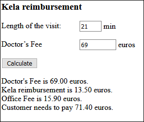

# Doctor's Visit

One of the cottage retreat participants is hurt and needs to visit a private doctor. Kela pays back some part of the private medical treatment, e.g. of the doctor’s fee.

The maximum Kela reimbursement (Kela-korvaus) is decided based on the following table: 
```
-Doctor’s visit, no more than 10 min, 8.00 euros
-Doctor’s visit, no more than 20 min, 11.00 euros
-Doctor’s visit, no more than 30 min, 13.50 euros
-Doctor’s visit, no more than 45 min, 16.50 euros
-Doctor’s visit, more than 45 min, 21.00 euros
```

The office fee of the Doctor's visit is always 15.90 euros (no Kela reimbursement available for that).

Make a function (1.), which gets the length of the visit as a parameter and returns the maximum Kela reimbursement. Convert the length to a number value with the parseInt() function before calculation.

Make a function (2.) which calculates the how much the customer has to pay after the Kela reimbursement has been given. Function gets as parameters the Doctor’s fee before reimbursement and the maximum Kela reimbursement. The function returns the amount left for the customer to pay. Convert any needed input values as number using the parseInt() or parseFloat() functions before calculations.

Make a function (3.) that is called when the button is clicked. It naturally uses the functions (1.) and (2.). Use descriptive and long enough function and variable names.

Sample output for shown input:

