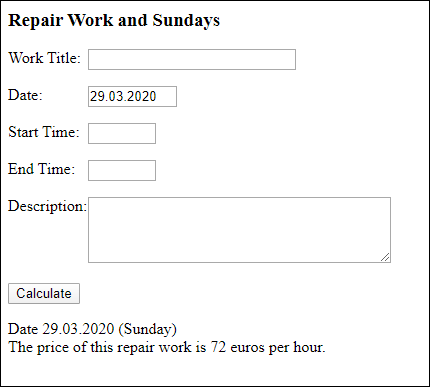
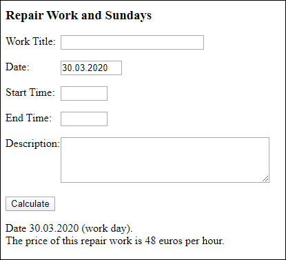

# Price of Work and Sundays

A construction firm is doing small repairs. Make a program for inputting the repair work details and calculating its price. The price for an hour of work is 48 euros during the workdays and 72 euros on Sundays. Define there the following function: isSunday(dateText) . The function will be called in function calculate().

Sample output for shown input:

